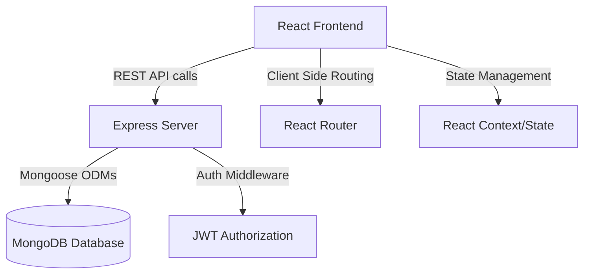

# 🚀 NexusCRM - Full Stack Development Internship Project

## 🎯 Project Overview
NexusCRM is a fully functional Customer Relationship Management (CRM) system built for businesses to seamlessly manage customers, leads, sales, and communication. This project was developed as part of the Infobharat Interns Full Stack Development Program.

## ✨ Features Implemented
- **Stunning UI/UX**: Premium modern dark theme with glassmorphism, glowing accents, and fluid animations.
- **Authentication System**: Secure login portal with role-based access control (Admin, Sales, Manager).
- **Dashboard**: Real-time business metrics and charts displaying revenue vs leads overview.
- **Customer Management**: Detailed tables with search capabilities to easily track customer information.
- **Lead Pipeline**: Interactive Kanban board to manage deals and move leads across stages (New, Contacted, Qualified, Converted).
- **Backend API**: RESTful endpoints built with Node.js and Express to manage CRM data.
- **Database Architecture**: Scalable MongoDB schema design.

## 🛠 Tech Stack
- **Frontend**: React (Vite), Tailwind CSS v4, React Router DOM, Recharts, Lucide React
- **Backend**: Node.js, Express.js
- **Database**: MongoDB (Mongoose)
- **Authentication**: JWT, bcryptjs (Backend implementation)

## 📁 Architecture Diagram

## 🗄️ Database Schema
- **Users**: `_id`, `name`, `email`, `password_hash`, `role` (Admin/Manager/Sales)
- **Customers**: `_id`, `name`, `contact_person`, `email`, `phone`, `status`, `assigned_to`
- **Leads**: `_id`, `title`, `company`, `value`, `stage`, `created_at`, `updated_at`

## 🚀 Setup Instructions

### 1. Clone the repository
\`\`\`bash
git clone <your-repo-link>
cd "RAJESH PROJECT"
\`\`\`

### 2. Frontend Setup
\`\`\`bash
cd frontend
npm install
npm run dev
\`\`\`

### 3. Backend Setup
\`\`\`bash
cd backend
npm install
# Create a .env file and add MONGODB_URI and PORT variables
node server.js
\`\`\`

## 📸 Screenshots
*(Add screenshots of your Dashboard, Login, Leads Kanban, and Customers here)*

## 💡 Key Learnings
- Building a complex, state-driven application with React and Vite.
- Designing a premium, enterprise-grade dark UI using Tailwind CSS.
- Structuring scalable REST APIs and handling cross-origin resource sharing (CORS).
- Working with real-world scenarios such as sales pipelines and role-based access control.

---
**Developed with ❤️ by snehitha**
